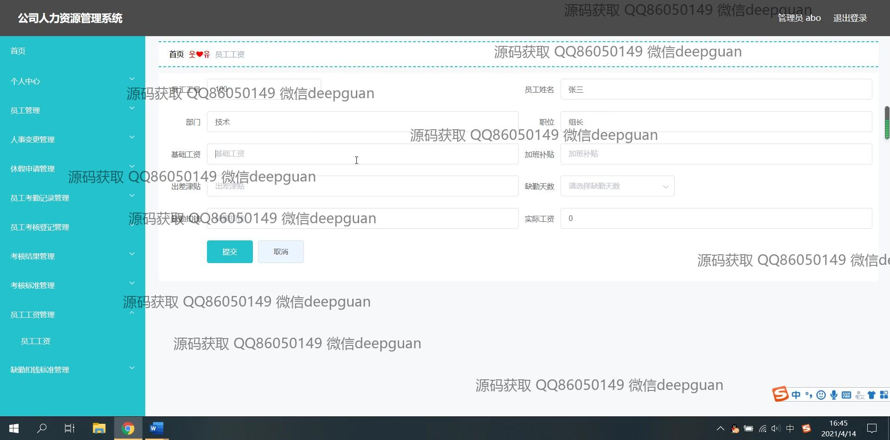

<h1 align="center">公司人力资源管理系统设计实现+vue</h1>

## 简介
公司人力资源管理系统：包括用户中心、员工管理、休假申请、考勤记录、考核管理、工资管理等功能，支持员工信息维护、考勤记录、考核评价、工资核算和在线注册登录，旨在提升企业人事管理效率。    --计算机毕业设计源码；毕设源码；java毕业设计源码

## 联系方式

<h3 align="center">获取完整代码与数据库文件 + 微信：deepguan QQ: 86050149 QQ群: 783742310</h3>

<h3 align="center">可帮忙远程部署 包运行成功！提供远程部署、修改代码、设计文档指导、代码讲解等服务！</h3>

## 功能介绍（完整见运行截图）
管理员：基本功能包括登录、注册和退出。主要管理模块有个人中心管理、员工信息管理、人事变更管理、假期申请管理、员工考勤记录管理、考核结果和标准管理以及员工工资管理。系统允许管理员进行员工新增、修改、删除操作，管理考勤信息，输入和编辑考核记录以及考评标准，管理工资信息如基础工资、加班补贴和出差津贴，设置缺勤扣钱标准。管理员可通过导航栏进入各功能模块进行相应操作，包括查看详细信息、审核状态和操作日志。界面设计支持搜索功能，按工号、姓名或部门查询员工，实现人力资源的全面管理和高效运营。

用户：基础功能包括登录、注册和退出。用户可访问个人中心浏览和更新自身信息，提交假期申请并查询考勤记录。系统提供用户考核信息提交和查看功能，包括输入考核日期、评分、编辑评价内容等。用户可访问工资查看模块，查询部门、职位及工资详情如基础工资和各种补贴，并了解个人考核结果。用户可以通过系统界面提交或取消编辑操作，提升日常事务处理的便捷性。同时，用户角色设置支持根据不同权限选择管理员或员工进行系统登录和功能访问，确保数据安全和权限管理。

## 运行截图

本代码来源于网络,仅供学习参考使用!

